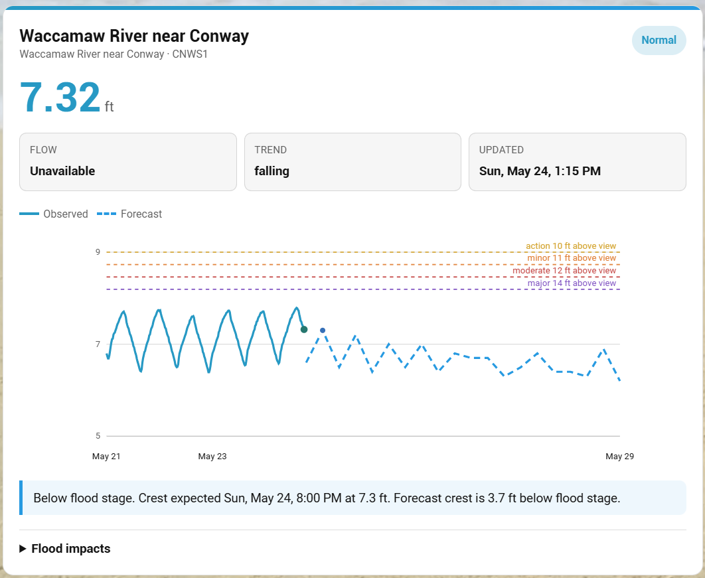
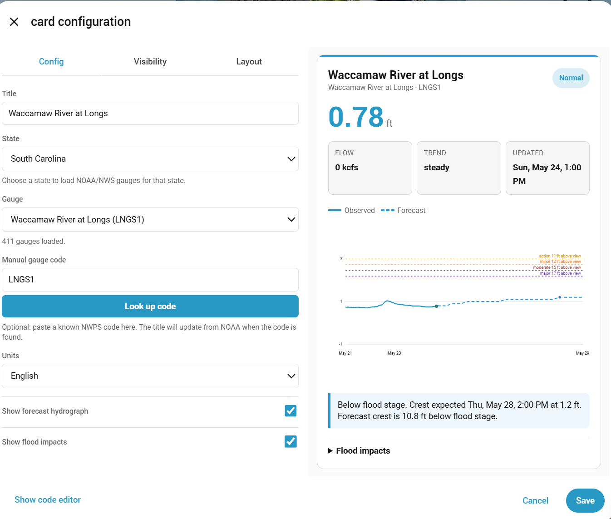

# RiverWise Card

RiverWise is a Home Assistant custom dashboard card for river, lake, reservoir, tailwater, and flood gauges. It supports NOAA/NWS National Water Prediction Service gauges in the United States and Environment Agency flood-monitoring stations in England.




## Features

- Current gauge name, ID, stage, flow, trend, and update time
- Flood category awareness from NWPS metadata
- Observed and forecast hydrograph
- Flood threshold lines and forecast crest marker
- Forecast summary with distance to flood stage
- Optional flood impact statements
- Visual editor with state and gauge selectors
- UK Environment Agency station search
- Home Assistant theme-aware styling
- Behind-the-scenes debug state for troubleshooting

## Installation

### HACS

Add this repository to HACS as a custom repository:

```text
https://github.com/TheWillMiller/river-wise
```

Category:

```text
Dashboard
```

After installing with HACS, add this dashboard resource if HACS does not add it automatically:

```text
/hacsfiles/river-wise/river-wise-card.js
```

Resource type:

```text
JavaScript module
```

### Manual

Copy `river-wise-card.js` into your Home Assistant `www` folder:

```text
/config/www/river-wise-card.js
```

Add it as a dashboard resource:

```text
/local/river-wise-card.js
```

Resource type:

```text
JavaScript module
```

After replacing the file, bump the resource URL to clear frontend cache:

```text
/local/river-wise-card.js?v=1
```

## Example YAML

```yaml
type: custom:river-wise-card
title: Ohio River at Meldahl Dam
provider: us_nwps
gauge: MELO1
gauge_state: OH
units: english
show_forecast: true
show_impacts: true
```

UK Environment Agency example:

```yaml
type: custom:river-wise-card
title: Bourton Dickler
provider: uk_ea
uk_station: 1029TH
units: metric
show_forecast: false
show_impacts: true
```

## API

RiverWise uses NOAA/NWS NWPS API endpoints directly for US gauges:

```text
https://api.water.noaa.gov/nwps/v1/gauges/{identifier}
https://api.water.noaa.gov/nwps/v1/gauges/{identifier}/stageflow/observed
https://api.water.noaa.gov/nwps/v1/gauges/{identifier}/stageflow/forecast
```

The visual editor loads state gauge lists from:

```text
https://api.water.noaa.gov/nwps/v1/gauges
```

with bounding-box query parameters for the selected state.

For UK Environment Agency stations, RiverWise uses:

```text
https://environment.data.gov.uk/flood-monitoring/id/stations
https://environment.data.gov.uk/flood-monitoring/id/stations/{id}
https://environment.data.gov.uk/flood-monitoring/id/measures/{id}/readings
```

UK data uses Environment Agency flood and river level data from the real-time data API (Beta).

## Notes

Forecast data is not available for every gauge. RiverWise will still render observed data when forecast data is missing.
